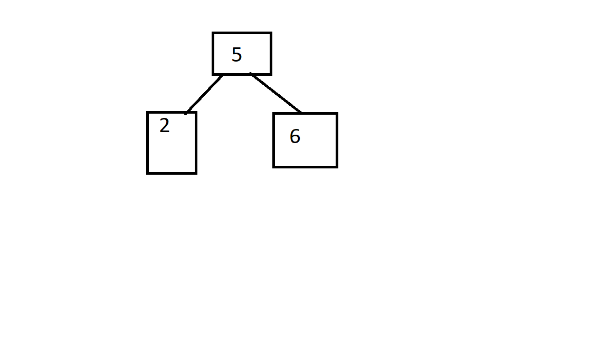
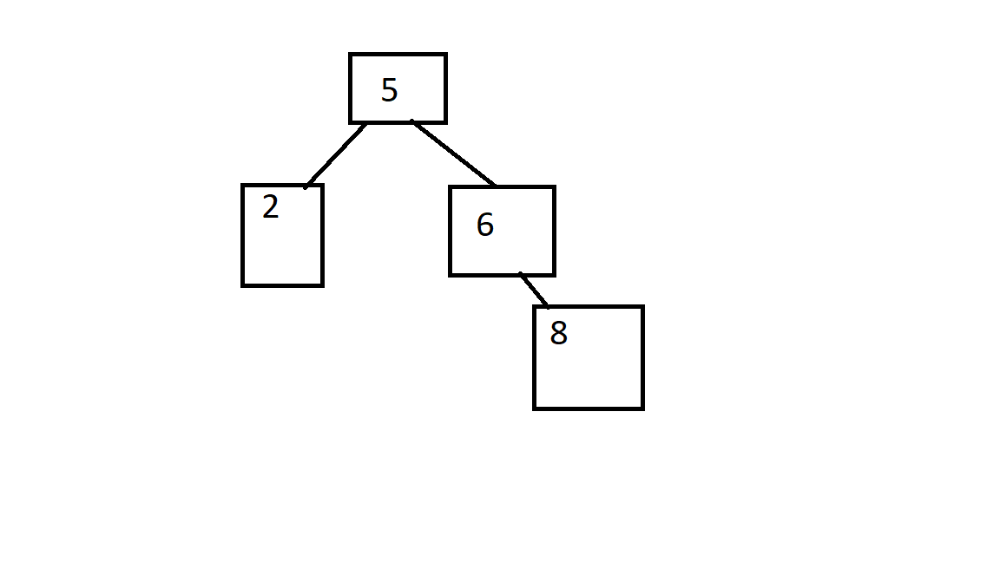
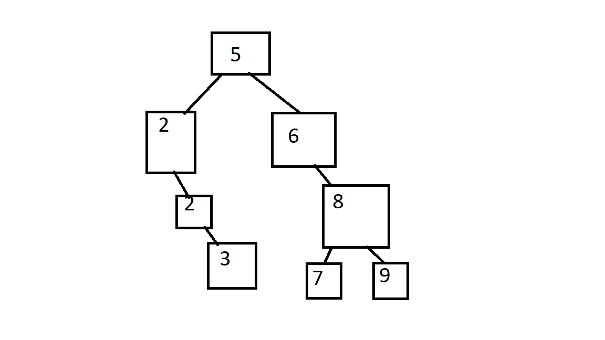
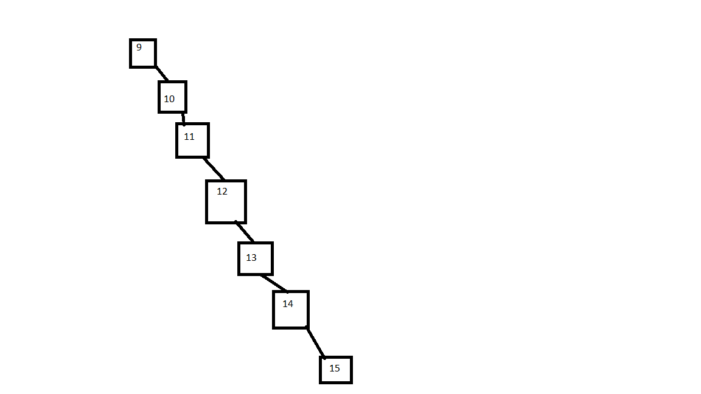

# Binary Search Tree's

## What is recursion

A binary search tree is an incredibly genius data structure. Before I explain a binary search tree, however, you need to understand recursion, as recursion is how a binary search tree works. Simply put, recursion is when a function calls itself. Unfortunately, recursion is a long and difficult topic, and it is very hard to understand over text. Luckily, `Web Dev Simplified` has a great and quick tutorial to teach recursion. You can find it [here](https://youtu.be/6oDQaB2one8).


## What is a binary search tree?

So now that recurison is out of the way, we can talk about a binary search tree, or a BST for short. Google defines binary as "relating to, composed of, or involving two things". A tree starts from a single root, and has many branches. A binary search tree starts from a single root (hence the tree), and branches off twice (hence the binary). When we want to add something, we put it to the left or to the right. If we use integers, we can put smaller numbers (relative to the root) to the left, and bigger or equal to numbers on the right. 

Lets create an example. First, we will add a 5 to the search tree. 5 becomes our root. Next, we will add a 6 and a 2. The binary search tree looks like this: 



Notice how we put the 6 to the right since its bigger, and the 2 goes to the left. In a BST, we limit the amount of branches a single node has to 2, thus, the 5 root is full. So what do we do if we want to add an 8? Well first we compare the 8 to the root (5). Since it is bigger, we pass it down to the right. Now we are comparing 8 to 6. Since 8 is bigger than 6, we put 8 to the right. Finally, 8 has an empty space to go to, so we put 8 like this: 



Following this system, we can add the following numbers: 2, 3, 7, 9. After we add those (in that order) the tree will look like this: 



Notice how the new 2 went to the right. This is because, as mentioned above, we put smaller numbers to the left, and everything else (including equal numbers) to the right. Thus, all these numbers fall into their place.

## Performance

In the overview page we talked about big O notation. I showed the graphs for the following performances: `O(1)`, `O(n)`, and `O(n^2)`. There is one more common type of performance: `O(log n)`. When compared with the other lines, it looks like this: 


In this image, the purple line is `O(log n)`. Notice how it is almost as fast as `O(1)`. `O(log n)` is considered super fast performance, and it is nearly the holy grail of speed. 

When a search tree is properly balanced (I'll explain later), searching through it has an `O(log n)` performance. This makes a binary search tree an incredibly fast and powerful data structure.

## Balancing

Balancing essentially refers to the differing lengths of all the branches of the tree. If we look back at the example above (I'm putting it again below), we can see that this tree is balanced.


Now, lets see an unbalanced search tree. Create a tree and start it with the number 9. Next, we add 10, 11, 12, 13, 14, and 15 in that order according to the same rules we used before. This new tree looks like this: 



This is a very unbalanced search tree. Notice how it is a single branch that spans the whole system. Instead of `O(log n)` for searching, this tree has a performance of `O(n)`. This is a huge performance loss, and so you want to keep your tree balanced.

I won't go into too much detail on balancing algorithms. That is beyond the scope of this class. However, if you are interested in learning more, look up the `Adelson, Velskii, Landis` algorithm. For now, we can try to make sure we aren't adding data that is constantly bigger or constantly smaller right after each other, but that the data has entropy. 


## Example problem

This task is similar: using Python3, create a BST class that holds simple integers. 

First, we create the BST class, and we will also create a nested Node class:

```python

class BST:

    class Node:

        def __init__(self):
            pass 


    def __init__(self):
        pass

```

Let's design the node class first. We will have the following attributes: `self.left` and `self.right`. Each of these will be references to other Node objects (these will be initialized as `None`. We will deal with adding these later). We wil also have the `self.value` attribute that will hold the actual value of the node. This value will be passed into the constructor. This looks like this: 

```python

class BST:

    class Node:

        def __init__(self, value):

            self.left = None
            self.right = None

            self.value = value
 


    def __init__(self):
        pass

```


Next, we will create the BST constructor. This will only have the `self.root` value. This will represent the root Node, but for now we will initialize it as None.

the constructor now looks like this: 

```python

    def __init__(self):

        self.root = None


```

We will now add the method `add_value(self, new_value)` to the BST class. This `add_value()` method needs to first check if `self.root` is None. If it is, then we assign this new_value to the root. Otherwise, we will call the `self._add_value()` method. This is where the recursion comes in. If the root is taken, then we will need to recurse down the tree until we find a spot for the new value. This `self._add_value()` method will be our method for recursion. It will take in the current node as well as the new_value. This looks like this:

```python

    def add_value(self, new_value):

        # Check if root is empty
        if self.root == None:
            self.root = self.Node(new_value)

        
        # Else recurse to find a place for the new value
        else:
            self._add_value(self.root, new_value)
 

    def _add_value(self, cur_node, new_value):

        pass

```

Next we need to design this _add_value method. This method needs to check if the new_value needs to go right or left. This looks like this: 

```python

    def _add_value(self, cur_node, new_value):

        if new_value < cur_node.value:
            # Go left
            pass

        else:
            # Go right
            pass


```

We now have two sections, one for each direction. Inside, we need to check if the node in that direction is None. If it is, then we have found a spot for the new_value and we can create a new Node object and assign it in that direction. If that direction is NOT None, then we can recurse again using the node in that direction as the `cur_node` parameter. That looks like this:

```python

    def _add_value(self, cur_node, new_value):

        
        # Handles going left
        if new_value < cur_node.value:

            # Checks if this is empty
            # If it is, then set the left 
            # as the value
            if cur_node.left is None:
                cur_node.left = self.Node(new_value) 

            # Since it is not none, we recurse
            else:

                self._add_value(cur_node.left, new_value)

        # For going right
        else:

            # checks if right is None
            if cur_node.right is None:
                cur_node.right = self.Node(new_value)

            # Recurses if right is something
            else:

                self._add_value(cur_node.right, new_value)

```

Finally, we need a way to print the BST. When we call `print()` on an object, it tries to call the `__str__` method. If we implement this method, then we can control what `print()` says. We will need to recurse down the tree in order to print all the items, so we will also create a `_str_helper` method. Let's start by creating the methods:

```python

    def __str__(self):
        pass

    def _str_helper(self, cur_node):
        pass

```

Notice that the `_str_helper` method takes in the `cur_node` parameter. This is to help it keep track of where it is recursing. First let' sdesign the `__str__` method. All this method needs to do is check if self.root is None. If it is we will return a string saying so. Otherwise, we will call `_str_helper` on self.root and return the result. This will end up looking like this:

```python
    def __str__(self):

        # Checks if the tree is none
        if self.root is None:
            return "Tree is empty!"

        # Else call helper method
        else:
            return self._str_helper(self.root)

    def _str_helper(self, cur_node):

        pass


```


Now we need to build the `_str_helper` method. First, we need to check if the cur_node is None. If it is, that means we've reached the end of this branch, and thus we will just return an empty string. If it is not None, then we will recurse in both directions. This will look like this:

```python

    def _str_helper(self, cur_node):

        if cur_node is None:
            return ""

        else:

            # Recurses with left, self, then right
            left_branch_str = self._str_helper(cur_node.left)
            this_node_val = str(cur_node.value)
            right_branch_str = self._str_helper(cur_node.right)

            full_str = left_branch_str + " " + this_node_val + " " + right_branch_str

            return full_str


```

The recursion return line is a little confusing, so let me explain it. We want it to print the numbers in order. Thus we need to print everything to the left, the current node, and then the right. Thus, we recurse left, and assign that string to a variable. Then we get the string of the current node's value. Then we get the right branch and assign that string to a third variable. Finally, we concactinate all of those variables together, with spaces and assign that to `full_str`. We can then return `full_str`. This will successfully recurse, and return the full string.

We can then test this code using the following:

```python

# Test
bst = BST()

# Add things
bst.add_value(5)
bst.add_value(3)
bst.add_value(7)
bst.add_value(2)
bst.add_value(4)
bst.add_value(5)

# Print
print(bst)

```

I have compiled all of this into a single file. You can find that file [here](./examples/bst_example_full_solution.py)


## Practice Problem

Here is your practice problem for this lesson: take the BST class we just created, and implement `.to_list()` and `.find_item()` methods. The `.to_list()` should return a list of all the items in the BST in acending order. The `.find_item()` should return the Node object that has that value. I have created a file with the current BST class as well as empty `.find_item()` and `.to_list` methods [here](./practice_problems/problems/bst_problem.py). You are welcome to check that file if you get stuck. It might also be helpful to reference the `__str__` method. 


## Conclusion

Binary search trees are incredible for storing data that you will need to search through. All though we simply used integers to store, we could put anything in a BST. For example, we could store user data by hashing usernames and using those hashes as the key in the BST. Using recursion, you can search through a tree for a user in O(log n) speed, which is incredibly fast, thus making Binary Search Tree's an incredibly powerful tool in your tool belt. 
