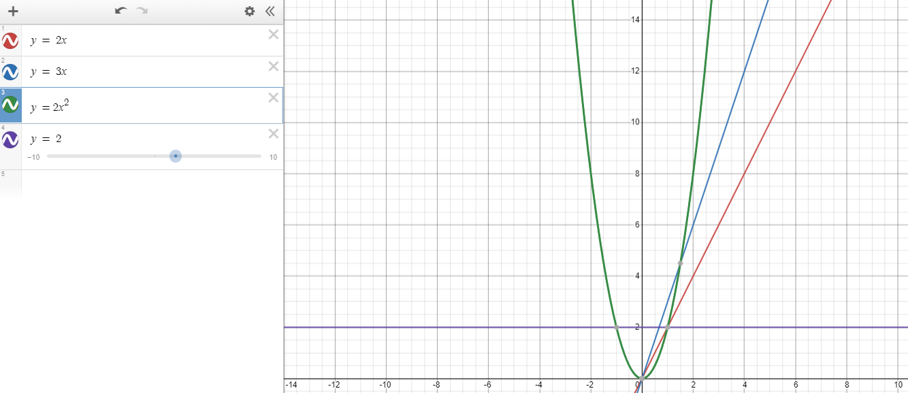

# Welcome

## Introduction

This course is intended to teach you the basics of three data structures: stacks, sets, and binary trees.This course will teach you the pro's and con's of each data structure, as well as teach you how to implement each data structure in Python3.


# First, some basics

## What is "performance"

Performance is how many resources are needed to run a program. There are two types of performance:

* Memory usage
* CPU time

Memory usage is how much computer memory is consumed while running the program, and will not be considered in this course. 

CPU time is how long it takes the CPU to actually run the program, and will be the performance we focus on in this course. 

## Big O notation

Big O notation is a way of describing how the performance of code changes as the amount of data changes. This makes it a good tool to describe the performance of a data structure as a whole. 

So how does it work?

Lets start by analyzing the following Python3 code:

```python

def some_function():
    for x in range(0, 10):
        print("Hello world")

```

This code will print "hello world" to the console 10 times. It uses 2 lines of code, but since it is a loop, both of those lines of code runs twice. Thus, 20 lines of code run for this program. Let's call this O(20).

Now lets take a look at this function:

```python

def count_up_to(n):

    for x in range(0, n):

        print(x)

```


So how many lines of code will run for this program? The answer is we don't know. It changes based on what is inputted for the parameter `n`. For every `n`, two lines of code are runned (the for loop statement and the print statement). So we can describe the performance for this function as `2n`. 


Take a look at this similar function:
```python
def count_up_to_2(n):
    for x in range(0, n):
        print(x)
        print("printing next")
```

This code is similar, but it has one more line in the for loop. So this has a performance of `3n`

Finally, lets look at this code:

```python


def count_up_twice(n):

    for x in range(0, n):

        for i in range(0, n):

            print(x, i)

```

With the parameter of 2, this function will have the following output:

```
0 0
0 1
1 0
1 1
```

With the parameter of 4, the output is this:

```
0 0
0 1
0 2
0 3
1 0
1 1
1 2
1 3
2 0
2 1
2 2
2 3
3 0
3 1
3 2
3 3

```

Notice how many more outputs the parameter of 4 has. Even though 4 is only twice as big as 2, the output is actually 4 times as big. This is because of that nested for loop. The function `count_up_twice(n)` has a performance of something closer to `2n^2`. 

Lets take a look at the following graphs courtesy of desmos:



The purple line is the `some_function()` function. The `count_up_to(n)` is the red line. The `count_up_to_2(n)` is the blue line. Lastly, `count_up_twice(n)` is that green line. It has that time cost of `2n^2`. 

In big O notation, we really only care about how it changes as more data is inputted. In other words, we care about the shape of those lines. We define big O notation like this: O([performance]). So `some_function()` has a performance of O(1), meaning it doesn't change based on the input. 

It gets more interesting when we look at the other functions, however. The `count_up_to(n)` has a performance of O(n). The `count_up_to_2(n)` also has a performance of O(n). Although it does take a bit longer, the shape of the line is the same, so the big O notation is the same.

Lastly, lets take a look at `count_up_twice(n)`. Because of this nested for loop, the time it takes to run is exponential. This is O(n^2). Notice how that green line takes off. If we zoom out of the graph, we see something quite scary.


Notice how the green line is almost vertical. Big O notation is only used when you're dealing with big data. Think data sets hundreds of thousands, or even millions long. At just 10,000, O(n^2) appears to be vertical. This is considered very poor performance, and should be avoided if at all possible. 

Viewing this performance as data increases is the point of Big O notation. 


# Stacks

## What is a stack?

A stack is a data structure that is a list of items. The items are added to the stack in the order they are added, and the last item added is the first item to be removed. We call this a LIFO (last in, first out) data structure.

- ## How to use a stack

 - ## Performance of a stack

    -  Dynamic arrays
    -  Big O notation of the stack

* ## Uses

    - What does a stack excel at

    - Where are stacks used

- ## Example python problem

- ## Practice problem


# Sets

## What is a hash

## What is a set

## Conflict resolution

## Performance of a set

## Sets in Python3

## Set example problem

## Set practice problem


# Binary Tree

- Recursion
- What is a Binary Search Tree
- Performance


